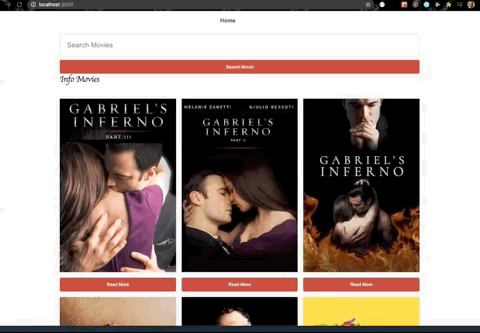

# infomovies

Set Up and Run Application:
1- Clown app
2-Run npm install
3-Create a database with the name infomovies
4- Enter the TMDB key into server where TMDB is called
5- Run npm run dev (application run on localhost:3000)

Application was built using nextjs, ReactJs.
I chose NextJs because of the server Side rendering that it comes prebuilt with. That allow for a faster boot of our application. React Hooks and easy-peasy package was also used to manage our state.

API:
Our movie information API is TMDB which allow us to get movie information through our server using specific routes to get the exact informations needed to display for our user.

-Application also display movies with pagination of top 10 movies
-When clicking on a specific movie, Users are able to get the informations of that movie, details such as: Title, Director, Release Year, Description, and productions if available.
-The search bar lets us look for specific movies and look through all the results of that movie and choosse the one you are trying to read about.
-Each movie comes with a thumbs up, thumbs down character to let the user vote on the movie. However, the thumbs down and thumbs up only let you vote once per day just to try to mimic a user being logged in which is handled through the server.
